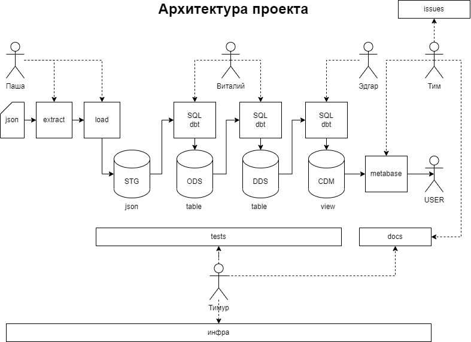

# de-pro4
Проект курса Data Enginner в Яндекс.Практикум, выполняемый в формате однодневного хакатона.

Во всех системах используются креды: de_user / de_pass , кроме metabase (там при первом старте)

Запуск инфрастуктуры
``` bash
docker-compose up -d
```

## Архитектура


## Установка и настройка DBT
Для разработки dbt должен быть установлен локально. Контейнер `dbt`в настоящий момент используется только для генерации документации.
Рекомендуется использовать `python3.9` или сделать `venv`.  
Установить dbt и активировать. 
``` bash
cd dbt
python3.9 -m venv venv
source venv/bin/activate
pip install dbt-postgres
dbt
```
Настроить профиль соединения DBT в файле `~/.dbt/profiles.yml`.

``` yml
prj:
  outputs:

    dev:
      type: postgres
      threads: 2
      host: localhost
      port: 5432
      user: de_user
      pass: de_pass
      dbname: de
      schema: stg
```
Проверить соединение
``` bash
dbt parse
```
Построение и обновление хранилища
``` bash
dbt run
```
Обновление отдельной модели
``` bash
dbt run --select full_model__with_sufix
```
Обновление всего хранилищая кроме модели
``` bash
dbt run --exclude full_model__with_sufix
```
Для отладки удобно использовать
``` bash
dbt compile
```
После этого в target будут скопбилиированы применяемый SQL скрипты.

## Генерация документации
``` bash
cd dbt
dbt docs generate
```
Запускается по адресу [http://localhost:9090](http://localhost:9090)


## Airflow
Разрабатываем DAG в [./airflow/dags](./airflow/dags)

## DBT
Разрабатываем DWH в виде SQL (select выражений) в [./dbt/project](./dbt/project)

## Инициалиазция 


